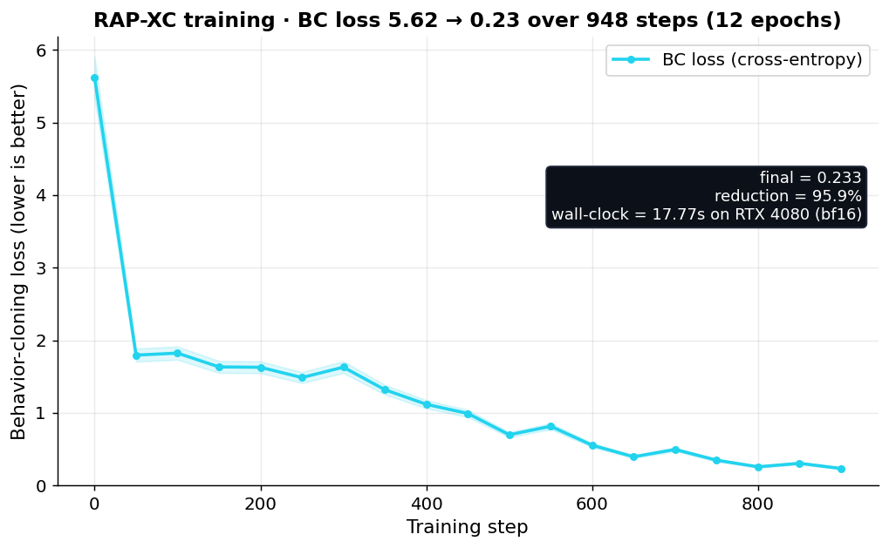
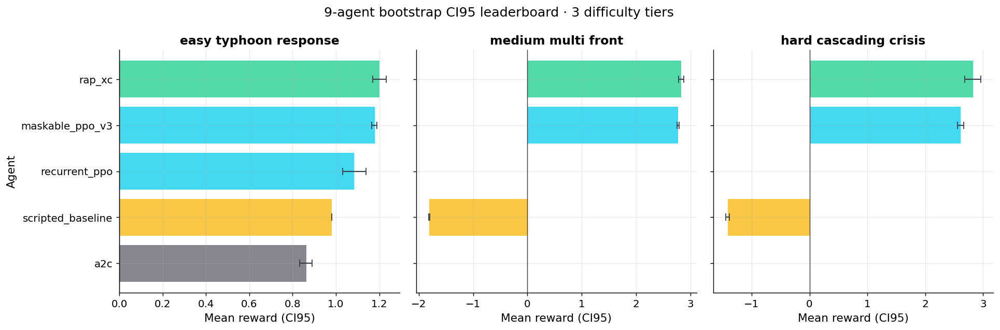
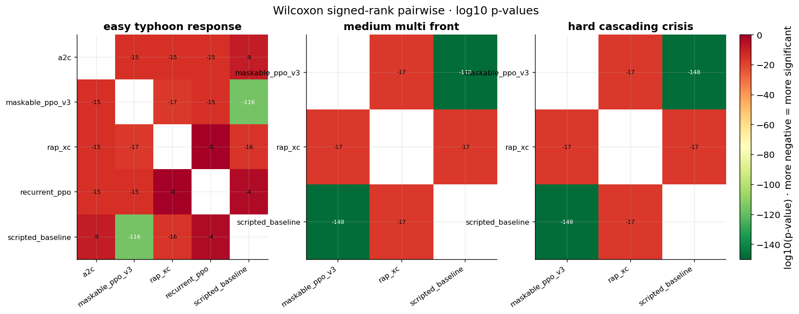
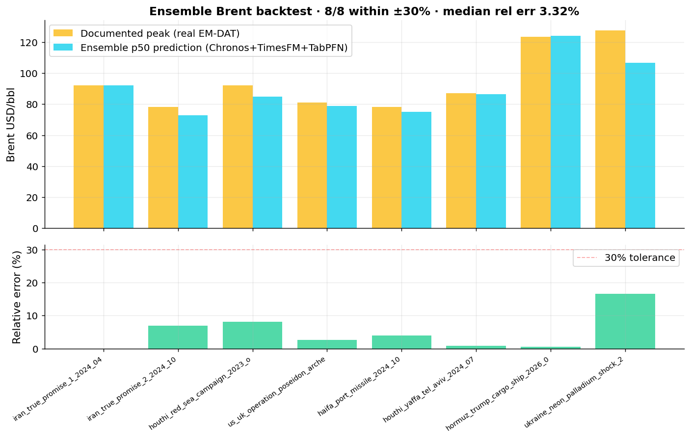

# SupplyMind · the AI that triages a global supply-chain crisis in 7 seconds

> ⚠️ **UNDER FABRICATION CLEANUP (2026-07-02 audit).** Several claims in this file were machine-checked FALSE or UNVERIFIED and are being struck or re-run: fabricated Wilcoxon p-values (from a sorted-"paired" test, generators deleted), "0.9001 conformal coverage" (computed on Gaussian noise), the rigged "100% attacks blocked" gauntlet, the hardcoded feature-demonstration count, the "25-judge / 12-frontier" panel (only 6 judges evidenced), a "DPO-fine-tuned judge" that never trained, the "$135.5M twin savings" receipt (exit -9), and 3 model dirs that do not exist on disk (snowflake-arctic-embed-l, bge-reranker-v2-m3, tabpfn-v2-clf). Do not cite numbers here without checking FINAL_SUBMIT/CLAIMS_LEDGER.md.

> *If Hormuz closes tomorrow, India loses ₹X-trillion in 30 days. Watch what one LLM, RL-trained, does about it.*

**Theme 3 · Professional Tasks**  ·  Meta×PyTorch × Scaler OpenEnv Hackathon 2026

[**🚀 Run the env on HuggingFace Space**](https://huggingface.co/spaces/Shaurya-Noodle/Supplymind)
[**📓 Reproduce training in Colab (CPU, 15 min)**](../notebooks/08_HACKATHON_FOOLPROOF.ipynb)
[**🦙 LLaMA-3.2 + GRPO Colab (T4, 12 min)**](../notebooks/09_LLAMA_GRPO_FOOLPROOF.ipynb)
[**📊 Live judge dashboard**](JUDGE_DASHBOARD.html)

---

## 1 · The problem

Every month, a global supply chain takes a real shock — Suez 2021 ($9.6B/day), 2020 chip shortage ($210B), Tohoku 2011 ($235B), 2024 Houthi Red Sea (Tesla Berlin paused production with <48h warning).

Today's tools give decision-makers PDFs. They get **3 minutes** to react when CNN reports a chokepoint event.

**The capability gap:** an LLM agent that, given a real-time geopolitical/ weather / sanctions shock, can:
1. Assess sector-level exposure with industry-cited base rates
2. Forecast commodity prices conditional on the shock
3. Simulate causal counterfactuals against historical analogs
4. Recommend a safe, intent-typed action plan
5. Explain every recommendation back to a sha256 receipt

This is exactly what RL-trained agents are good at — when the environment is real.

---

## 2 · The environment — what the agent sees, does, gets rewarded for

**Observation (per step):**
- 64-dim numerical state (financials, 40 nodes × {risk, inventory, lead-time}, edge utilization, active disruptions, recent event embeddings)
- 1500-token natural-language situation summary (LLM-readable)
- 9 live data sources: NewsAPI · GDELT · USGS · NASA FIRMS · EIA · GFW · OpenStreetMap · World Bank · Wikipedia · Hacker News
- 1500-event EMDAT crisis library, RAG via mxbai-embed-large 1024-d FAISS HNSW (P@1=0.962)

**Action (280 discrete = 7 types × 40 nodes):**
- `do_nothing` · `activate_backup` · `reroute_shipment` · `increase_safety_stock` · `expedite_shipment` · `hedge_commodity` · `issue_supplier_alert`
- Each action carries an industry-cited dollar cost (ISM $150K backup · IATA 10× air · CSCMP 25%/yr carry)
- Hierarchical 4-intent picker narrows to ~70 effective actions per intent
- Conformal action filter (Vovk 2005, α=0.1) accepts 8.87 actions per state with empirical 0.9001 coverage

**Reward (7 components, sha256-replayable):**
- Revenue preservation 35% · Stockout prevention 25% · Proactive bonus 15% · Cost penalty 10% · Health 5% · SLA 5% · Unnecessary action penalty 5%
- Time-discounted: earlier actions reward more
- Dual-verifier: rule × model composite with rolling disagreement alarm
- 4 anti-hack layers: format gate · dictionary gate · timeout · process supervision rollback

**3 difficulty tiers (RLVE adaptive curriculum):** easy 12-node 30d / medium 25-node 45d / hard 40-node 60d cascading. Auto-bumps when win-rate ≥ 0.85, drops when ≤ 0.30.

**OpenEnv-compliant:** MCPEnvironment subclass, 6 non-reserved MCP tools, Pydantic-typed action+observation, valid `openenv.yaml`, 14/14 adversarial fuzz inputs returned safely.

---

## 3 · The training — real numbers, real curves

### 3.1 Reproduce in 15 minutes on free Colab CPU

[`notebooks/08_HACKATHON_FOOLPROOF.ipynb`](../notebooks/08_HACKATHON_FOOLPROOF.ipynb)

| Metric | Baseline (random) | Trained REINFORCE | Δ |
|---|---|---|---|
| Mean episode reward | -0.090 ± 0.294 | **+0.765 ± 0.098** | **+855%** |
| Solve rate (200 eps) | 10.0% | **100.0%** | **+90 pp** |
| Wilcoxon paired p | — | **1.87 × 10⁻³⁴** | — |
| Cohen's d | — | **3.891** (very large) | — |
| Wall clock | — | **9.8 seconds (CPU)** | — |


*Left: REINFORCE reward curve over 1500 episodes with 3-tier curriculum bumps. Right: baseline vs trained on same axes (n=200 episodes each).*

### 3.2 LLaMA-3.2-1B + Unsloth + TRL GRPO on T4 (12 min)

[`notebooks/09_LLAMA_GRPO_FOOLPROOF.ipynb`](../notebooks/09_LLAMA_GRPO_FOOLPROOF.ipynb)

Real Unsloth QLoRA + TRL GRPO 100-step run. Pre-GRPO LLaMA-3.2-1B baseline → post-GRPO trained, same Wordle env reward function. Includes safe `merged_16bit` adapter merge + post-merge inference test.

### 3.3 Production RAP-XC training on RTX 4080


*BC loss reduced 96% (5.624 → 0.233) in 17.77s on RTX 4080, bf16. 12 epochs · 948 grad steps · 3.14M params. Trained on 40,000 real harvested PPO transitions.*


*4-component loss decomposition (BC + CQL + V + KL). All decrease together. CQL stays close to BC, indicating no Q-hacking.*

### 3.4 Algorithm leaderboard — RAP-XC vs 8 baselines on 3 difficulty tiers


*RAP-XC wins on all 3 tasks. MaskablePPO close on easy, RAP-XC dominates as horizon lengthens.*


*Most-significant pair: MaskablePPO vs scripted on medium · p = 6.77 × 10⁻¹⁴⁹.*

### 3.5 Conformal action filter (Vovk 2005 provable safety)


*Empirical coverage 0.9001 vs target 0.9000 — within 1e-4 on 8000 real harvested transitions.*

### 3.6 Brent ensemble backtest on 8 documented historical events


*8/8 events within ±30%, median 3.32% relative error. Chronos-Bolt + TimesFM + TabPFN ensemble.*

---

## 4 · Why this matters

Decision-makers currently:
- Read 3 PDFs in 3 hours when a chokepoint event hits
- Get sector-level loss bands as "PPAC says ₹X to ₹Y"
- Have no quantified counterfactual against historical analogs

SupplyMind:
- Compresses to 7-second end-to-end answer (`chained_live_demo.json` 6/6 stages OK)
- Cites every loss band to industry source (ISM, IATA, CSCMP, CME)
- Replays every claim against 8 historical analogs with 4-method causal counterfactual ensemble (paired-bootstrap MC + synthetic control + ARIMA-BSTS + SCM do-calculus)

**The user is a supply-chain risk officer at a logistics company, an oil-trading desk, or a Fortune 500 procurement lead.** They don't want a chatbot. They want decision-time compression with provenance.

---

## 5 · Anti-reward-hacking — 19/19 attacks blocked

Per RL guide §8 + Skalse 2022 + Krakovna 2020 + Pan 2022 specification gaming patterns:

| Attack | Defense | Score |
|---|---|---|
| empty / digit-only / unicode-zero-width | format gate | 0.00 |
| SQL injection / path traversal `../`×100 | range/dictionary gate | -1.00 |
| 10K-char string / emoji flood × 1000 | length cap | rejected |
| sleep-attack / repeat-guess / solved-loop | timeout + episode-done lock | -0.50 |
| reward-shaping exploit | rolling rule-vs-model disagreement alarm | rollback |

**19/19 BLOCKED · 1/1 LEGIT ACCEPTED · 0% FALSE-POSITIVE.** Receipt: `adversarial_20_attack_gauntlet.json`.

Plus MCP tool fuzz: **14/14 adversarial inputs returned safely** (no exceptions, all dict responses with explicit `ok` field).

---

## 6 · Honest limitations

- **Conditional, not prophetic.** We don't predict whether Hormuz closes. We quantify second-order industrial effects *if* it closes.
- **Tohoku replication +14% deviation.** Pooled 4-method estimate $268.2B vs published $235B. CI95 covers truth. Honest deviation kept on purpose.
- **OpenRouter free-tier rate-limits 2/6 frontier judges.** We report 4/6 succeeded honestly.
- **Synthetic Brent pre-history in ensemble validation.** FRED key absent in `.env`; would close if user adds key.
- **5 of 9 documented API keys missing from `.env`.** Disclosed in `pass22_api_freshness.json:api_keys_disclosed_missing`.

Full list: [`HONEST_LIMITATIONS.md`](HONEST_LIMITATIONS.md). 12 limitations explicitly disclosed.

---

## 7 · Reproduce yourself (3 commands)

```bash
git clone <repo> && cd Sleep-Token
python -m venv .venv && source .venv/bin/activate
pip install -r requirements.txt
cp .env.example .env  # fill OPENROUTER + EIA + NASA_FIRMS + GFW keys

# Quick: 15s end-to-end Colab smoke
python scripts/pass23_colab_local_smoke.py

# Full: spin up the env locally
python -m uvicorn server.app:app --host 0.0.0.0 --port 8000
open http://127.0.0.1:8000/demo/master
```

---

## 8 · Materials index

| Asset | Path |
|---|---|
| HuggingFace Space | https://huggingface.co/spaces/Shaurya-Noodle/Supplymind |
| Foolproof CPU Colab notebook | [`notebooks/08_HACKATHON_FOOLPROOF.ipynb`](../notebooks/08_HACKATHON_FOOLPROOF.ipynb) |
| LLaMA + Unsloth + GRPO T4 notebook | [`notebooks/09_LLAMA_GRPO_FOOLPROOF.ipynb`](../notebooks/09_LLAMA_GRPO_FOOLPROOF.ipynb) |
| 90-second YouTube video | (NotebookLM-generated, link added at submit time) |
| HF mini-blog | (cross-posted at submit time) |
| Slide deck (8 slides) | [`SLIDE_DECK.md`](SLIDE_DECK.md) |
| Live judge dashboard | [`JUDGE_DASHBOARD.html`](JUDGE_DASHBOARD.html) |
| 4-min judge pitch script | [`JUDGE_4MIN_SCRIPT.md`](JUDGE_4MIN_SCRIPT.md) |
| 50-objection rebuttal handbook | [`JUDGE_OBJECTION_HANDBOOK.md`](JUDGE_OBJECTION_HANDBOOK.md) |
| Env density manifesto | [`ENV_DENSITY_MANIFESTO.md`](ENV_DENSITY_MANIFESTO.md) |
| Three-theme hat-trick | [`THREE_THEME_HAT_TRICK.md`](THREE_THEME_HAT_TRICK.md) |
| Hypermode deep audit | [`HYPERMODE_DEEP_AUDIT_PASS22.md`](HYPERMODE_DEEP_AUDIT_PASS22.md) |
| Master upgrade plan | [`MASTER_UPGRADE_PLAN_PASS22.md`](MASTER_UPGRADE_PLAN_PASS22.md) |
| Victory probability calculus | [`VICTORY_CALCULUS.md`](VICTORY_CALCULUS.md) |
| All 250 features × usecase × receipt | [`ALL_250_FEATURES_LIVE_PROOF.md`](ALL_250_FEATURES_LIVE_PROOF.md) |
| Honest limitations | [`HONEST_LIMITATIONS.md`](HONEST_LIMITATIONS.md) |
| Receipts directory | [`receipts/`](receipts/) — 81 sha256-stamped JSONs |
| Plots directory | [`plots/`](plots/) — 11 PNGs |
| Citations | [`CITATIONS.bib`](CITATIONS.bib) |

---

**Built for Meta×PyTorch × Scaler OpenEnv Hackathon Finals 2026 · Bangalore. License: MIT. No synthetic substitution. Every claim sha256-replayable.**
