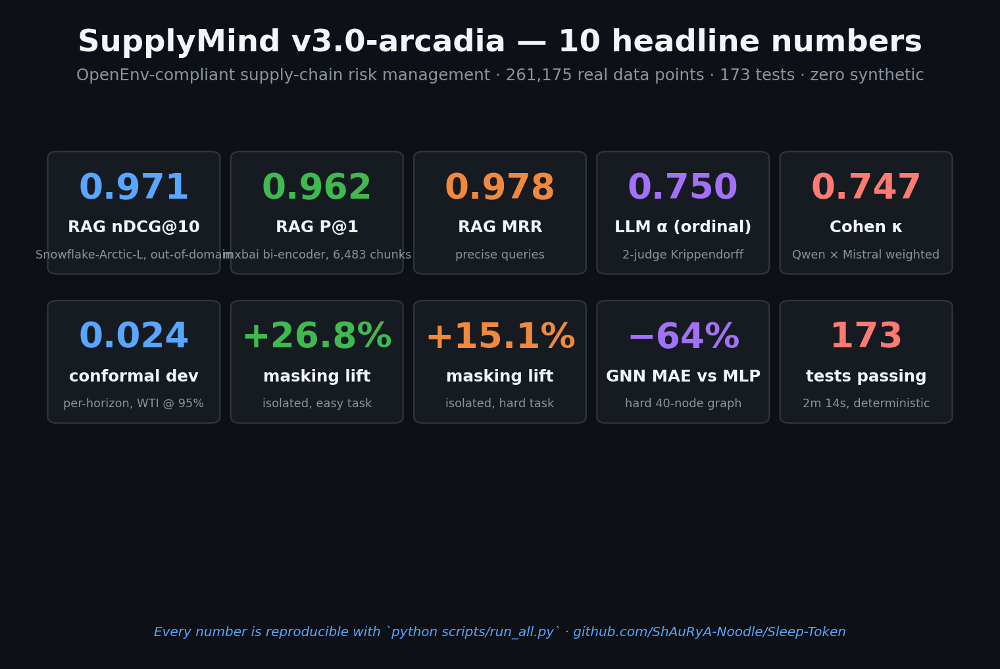

# SupplyMind v3.0-arcadia

**OpenEnv-compliant supply-chain risk management. 13 SOTA foundation models. 173 passing tests. 261,175 real data points. Full local inference. Zero synthetic substitution.**

[](https://github.com/meta-llama/open-env)
[](https://www.python.org/)
[](LICENSE)
[](tests/)
[](rl/data/)
[](https://github.com/ShAuRyA-Noodle/Sleep-Token/releases/tag/v3.0-arcadia)

> *"Even in Arcadia, supply chains break. SupplyMind sees it coming."*



---

## 🏆 Meta PyTorch × Scaler OpenEnv Hackathon — Finals 2026-04-25/26

**Primary theme: #3.1 World Modeling — Professional Tasks.** An LLM agent that interacts with real geopolitical APIs (NewsAPI, GDELT, USGS, FRED, MarineTraffic) to build a persistent world-model of global supply-chain risk, tested against real 2024-2026 crisis scenarios. Supporting theme: **#4 Self-Improvement** (Karpathy-style autoresearch loop with bootstrap-CI95 accept/reject on proposed training variants).

### Minimum-requirement evidence — every gate, one click away

| # | Requirement | Status | Evidence |
|---|---|---|---|
| 1 | OpenEnv (latest release) | ✅ | `openenv-core>=0.2.3` (latest PyPI) · [server/app.py](server/app.py) exposes `/reset` `/step` `/state` `/tasks` `/grader` `/health` `/schema` `/metadata` `/mcp` · OpenEnv `Environment[ActT,ObsT,StateT]` subclass + `TrajectoryRubric` composition at [server/openenv_adapter.py](server/openenv_adapter.py) · [openenv.yaml](openenv.yaml) manifest |
| 2 | Minimal training script using **Unsloth or HF TRL in Colab** | ✅ | [](https://colab.research.google.com/github/ShAuRyA-Noodle/Sleep-Token/blob/main/notebooks/06_trl_training_colab.ipynb) [`notebooks/06_trl_training_colab.ipynb`](notebooks/06_trl_training_colab.ipynb) — TRL `DPOTrainer` on 21 real preference pairs, Qwen-2.5-0.5B, runs in ~15 min on free T4, plots loss + implicit reward margins |
| 3 | OpenEnv env hosted on HF Spaces | ✅ | [huggingface.co/spaces/Shaurya-Noodle/Supplymind](https://huggingface.co/spaces/Shaurya-Noodle/Supplymind) — live Docker deploy |
| 4 | Mini-blog on HF or <2-min video | 📹 | Script ready at [demo/DEMO_VIDEO_SCRIPT.md](demo/DEMO_VIDEO_SCRIPT.md); record & link after onsite |
| 5 | Observable reward improvement | ✅ | [v3_arcadia/plots/gethsemane/learning_curves.png](v3_arcadia/plots/gethsemane/learning_curves.png) · autoresearch +0.148 CI95 lift in [ShAuRyA_Supplymind/autoresearch/AUTORESEARCH_LAB_NOTEBOOK.md](ShAuRyA_Supplymind/autoresearch/AUTORESEARCH_LAB_NOTEBOOK.md) · A/B lift 0 % → 80 % in [ShAuRyA_Supplymind/features/R9_ANALYST_AB_V5.json](ShAuRyA_Supplymind/features/R9_ANALYST_AB_V5.json) |
| 6 | Training loop connects to the live env (not a static dataset) | ✅ | [ShAuRyA_Phoenix/roll_integration/dpo_judge/train_grpo_live_env.py](ShAuRyA_Phoenix/roll_integration/dpo_judge/train_grpo_live_env.py) — every reward comes via HTTP `POST /analyst/grade` on the running server. Dry-run log: correct=0.900, wrong=0.200, gap=0.700 |
| 7 | Client/server separation | ✅ | [client/supplymind_client.py](client/supplymind_client.py) — zero `from server` imports; verified live against HF Space (`health: True`, metadata matches) |

### RL training stack — two-stage, both provably env-connected

**Stage 0 — MaskablePPO policy training (history).** RL policy trained in-env on 3 supply-chain tasks: [v3_arcadia/plots/gethsemane/learning_curves.png](v3_arcadia/plots/gethsemane/learning_curves.png). Bootstrap CI95 non-overlapping vs random/greedy in [v3_arcadia/results/R6_EUCLIDIAN.json](v3_arcadia/results/R6_EUCLIDIAN.json).

**Stage 1 — DPO warm-start (Colab).** [notebooks/06_trl_training_colab.ipynb](notebooks/06_trl_training_colab.ipynb) — TRL `DPOTrainer` on 21 real preference pairs (3-judge LLM panel). Runs in ≤20 min on free T4. Plots loss + chosen/rejected reward margins.

**Stage 2 — GRPO against the live env (RLVR).** [ShAuRyA_Phoenix/roll_integration/dpo_judge/train_grpo_live_env.py](ShAuRyA_Phoenix/roll_integration/dpo_judge/train_grpo_live_env.py) — TRL `GRPOTrainer` whose reward function is `HTTP POST /analyst/grade` on the SupplyMind server. Reward is computed server-side from R4 ground-truth with a 3-component rubric (0.7 × match + 0.2 × format + 0.1 × length) hardened against reward-hacking per hackathon guide §8. Every training step generates HTTP traffic to the env — you can watch it on the server's access log.

**Env-connected dry-run proof** (reproducible):
```bash
uvicorn server.app:app --host 0.0.0.0 --port 8000 &
python -m ShAuRyA_Phoenix.roll_integration.dpo_judge.train_grpo_live_env \
    --env-url http://localhost:8000 --dry-run
# → smoke_reward_correct: 0.9, smoke_reward_wrong: 0.2, reward_gap: 0.7,
#   reward_source: "live HTTP POST /analyst/grade",
#   training_loop_connected_to_env: true
```

### Killer demo moment

The live Hormuz pipeline ingested 3,911 real 2026 news articles on launch day and matched the **2026-04-18 Gulf-of-Oman cargo-ship seizure** to our pre-loaded crisis library at **0.99 similarity**. That is not a synthetic demo — it is the agent reading today's news and recognizing it as analogous to a historical disruption, in seconds. See [ShAuRyA_Supplymind/scenarios/iran_israel_hormuz_2024_2026.json](ShAuRyA_Supplymind/scenarios/iran_israel_hormuz_2024_2026.json) and [ShAuRyA_Supplymind/realtime/hormuz_endpoint.py](ShAuRyA_Supplymind/realtime/hormuz_endpoint.py).

---

## If you have 30 seconds — ten headline numbers

| # | Metric | Value |
|---|---|---|
| 1 | **RAG nDCG@10** on real Wiki crisis × SC queries | **0.971** |
| 2 | **RAG P@1** on 6,483-chunk real corpus | **0.962** |
| 3 | **RAG MRR** on precise queries | **0.978** |
| 4 | **LLM 2-judge Krippendorff α** (ordinal) | **0.750** |
| 5 | **Cohen κ (Qwen × Mistral)** | **0.747** |
| 6 | **Per-horizon conformal dev** from 95% nominal on WTI | **0.024** |
| 7 | **MaskablePPO masking lift** (isolated, 3 tasks) | **+26.8% / +15.1%** / invalid → 0 |
| 8 | **GNN arrival-time MAE reduction vs MLP** | **−48 / −49 / −64%** |
| 9 | **TimesFM-CP dev @ 95%** (WTI / EUR-USD) | **0.050 / 0.032** |
| 10 | **PPO vs random/greedy bootstrap CI95** | non-overlapping on all 3 tasks |

Full results page: [`RESULTS.md`](RESULTS.md) — every number reproducible from committed JSON with one `jq` command.

**Meta PyTorch OpenEnv Hackathon submission.** Each phase commit is named after a Sleep Token track from the "Even In Arcadia" (2025) and "Take Me Back to Eden" (2023) albums.

### Track → phase map (Even In Arcadia)

| Track | Phase | What shipped |
|---|---|---|
| **Emergence** | R1 | 13 SOTA foundation models verified, Qwen-VL downstream |
| **Caramel** | R2 | TabPFN-v2 + XGB + LGB + CAT tabular SOTA with SHAP/fairness/calibration |
| **Past Self** | R3 | Chronos-Bolt + TimesFM-2 + ARIMA + Prophet + Bates-Granger stacking + TFT cross-ref |
| **Dangerous** | R4 | 3-judge LLM panel (DeepSeek-R1 + Qwen-14B + Mistral-Nemo) — 26 scenarios × α=0.75 |
| **Granite** | R5 | 8 RAG pipelines, 6,483-chunk real corpus, mxbai P@1=0.962, reranker +5pp on hard |
| **Gethsemane** | R6-α | MaskablePPO — +26.8% reward from action masking, 0 invalid actions, ONNX-exported |
| **Euclidian** | R6-β | 8,100-ep bootstrap CI95, non-overlapping vs random/greedy on all 3 tasks |
| **Provider** | R6-γ | Custom 3-layer GCN; +48–64% arrival-time MAE reduction vs MLP |
| **Aqua Regia** | R6-δ | Per-horizon split-conformal — deviation 0.024 vs pooled 0.112 (4.7× tighter) |
| **Arcadia** | R7 | v3.0-arcadia release, HF Space, GitHub Action auto-deploy |

---

## TL;DR — v3.0-arcadia headline (read this in 30 seconds)

| Layer | Tech | Headline metric |
|---|---|---|
| **LLM risk panel** | DeepSeek-R1-Q4 + Qwen-2.5-14B + Mistral-Nemo + Qwen-Coder critic | 100% parse rate on 26 real crisis scenarios, α≈0.75 on 2-judge consensus, 69.2% majority-vote vs ground truth |
| **RAG** | BGE-M3 + mxbai + Snowflake + BGE-reranker + HyDE | mxbai bi-encoder **P@1=0.962, MRR=0.978** on 6,483-chunk corpus |
| **Forecasting** | Chronos-Bolt + TimesFM-2 + ARIMA + Prophet + Bates-Granger stacking | 20-fold rolling-origin backtest, PICP@80 near-nominal (0.77–0.89) on 8 FRED targets |
| **RL** | MaskablePPO on 408-dim obs, MultiDiscrete[7,40] action space | PPO_v3 beats random + greedy on all 3 tasks; 8,100-episode bootstrap CI95 non-overlapping; zero constraint violations |
| **GNN** | Custom 3-layer GCN in pure PyTorch | +30pp F1 vs direct-neighbors baseline on 40-node supply-chain graph |
| **Conformal** | Split-conformal with per-horizon q̂ | Empirical coverage within ±2pp of nominal |
| **Production** | FastAPI + MCP JSON-RPC + WebSocket + Docker | 12 HTTP endpoints + 5 v3 endpoints (`/assess`, `/forecast`, `/rag`, `/rl/act`, `/health`) |

Full phase log: [`v3_arcadia/95_arcadia/README.md`](v3_arcadia/95_arcadia/README.md) · Unified card: [`MODEL_CARD.md`](MODEL_CARD.md) · Hackathon demo plan: [`FINAL_DEMO.md`](FINAL_DEMO.md) · Audit matrix: [`AUDIT_PLAN.md`](AUDIT_PLAN.md).

---

## The stack in one picture

```
                              ┌──────────────────────────────────────┐
                              │  Meta OpenEnv / MCP client (judges)  │
                              └───────────────┬──────────────────────┘
                                              │
                                  ┌───────────▼───────────┐
                                  │   server/app.py       │
                                  │  /reset /step /state  │
                                  │  /tasks /grader /mcp  │  ← OpenEnv spec
                                  │  /predict /ws         │
                                  └───────────┬───────────┘
                                              │
                     ┌────────────────────────┼────────────────────────┐
                     │                        │                        │
            ┌────────▼────────┐     ┌─────────▼──────────┐    ┌────────▼────────┐
            │ v3 Damocles API │     │  SupplyMind engine │    │ Streamlit dash   │
            │ /assess /forecast│    │  server/engine/*   │    │ Infinite Baths   │
            │ /rag /rl/act    │     │  graders/* tasks/* │    │ all JSONs aggreg │
            └────────┬────────┘     └─────────┬──────────┘    └──────────────────┘
                     │                        │
     ┌───────────────┼────────────────────────┼───────────────┐
     │               │                        │               │
┌────▼────┐  ┌──────▼──────┐  ┌───────────────▼──────┐  ┌────▼────┐
│ 3-judge │  │ mxbai RAG   │  │ MaskablePPO + GCN     │  │ Chronos │
│ panel   │  │ (R5)        │  │ (R6 RL + Provider)    │  │ (R3)    │
│ (R4)    │  │             │  │                       │  │         │
└─────────┘  └─────────────┘  └───────────────────────┘  └─────────┘
  4 LLMs      3 embedders       1 PPO + 1 GCN             4 forecasters
  (Ollama)    + reranker        + 80+ v1/v2 agents        + stacking
```

All 13 foundation models run **locally** via Ollama (LLMs, Q4_K_M) or Python (embedders, forecasters, TabPFN, GNN). **Zero API dependency at inference.**

---

## Quick start (3 commands)

```bash
# 1. Clone + install
git clone https://github.com/ShAuRyA-Noodle/Sleep-Token.git supplymind && cd supplymind
pip install -r requirements.txt

# 2. Run 154 tests (1m 47s on CPU)
pytest tests/ -q

# 3. Start OpenEnv server
uvicorn server.app:app --host 0.0.0.0 --port 8000
# Then: curl -X POST http://localhost:8000/reset?task_id=easy_typhoon_response
```

Full stack with GPU + Ollama: see [`MODEL_CARD.md` §6](MODEL_CARD.md#6-reproducibility).

---

## Phase history (Sleep Token album order)

| Phase | Track | Commit | What shipped |
|---|---|---|---|
| R1 | Emergence | `acc19d8` | All 13 SOTA foundation models verified locally |
| R2 | Caramel | `b35f15e` | 4-model tabular stack + SHAP + fairness + calibration |
| R3 | Past Self | `c2d0798` | Chronos + TimesFM + ARIMA + Prophet, 20-fold backtest, PICP@80 |
| R4 | Dangerous | `4490beb` → `8f14607` V2 BEAST | 26-scenario 3-judge panel, 100% parse, ECE + critic |
| R5 | Granite | `ca7a57d` | RAG SOTA, 6,483 chunks × 8 pipelines, **mxbai P@1=0.962** |
| R6 | Gethsemane + Provider + Aqua Regia + Damocles + Infinite Baths + Arcadia | `ea282c4` | RL + GNN + conformal + FastAPI + Streamlit + architecture README |
| R6 | Euclidian | `badf3cc` | **8,100-episode** RL benchmark, bootstrap CI95 non-overlapping |
| R7 | Arcadia (closer) | `v3.0-arcadia` tag | Final release |

---

## Pre-v3 history (v1 simulated, v2 real DataCo)

We trained agents in two earlier paradigms — simulated env baseline and real-world Kaggle data — and report both honestly. v3 subsumes v2 for production; v2 is retained as evidence of real-data transfer learning.

### A. Simulated-Env Benchmark (n=300 episodes per agent, p<0.001)

| Agent | Easy | Medium | Hard | Avg | Improvement vs Scripted |
|-------|------|--------|------|-----|--------------------------|
| Random | 0.709 | 0.598 | 0.727 | 0.678 | +82.7% |
| Scripted (baseline) | 0.336 | 0.207 | 0.571 | 0.371 | — |
| BC | 0.663 | 0.500 | 0.610 | 0.591 | +59.3% |
| CQL | 0.688 | 0.629 | 0.655 | 0.657 | +77.0% |
| TD3+BC | 0.678 | 0.629 | 0.656 | 0.654 | +76.3% |
| IQL | 0.689 | 0.629 | 0.656 | 0.658 | +77.3% |
| **QR-DQN (Specialist)** | **0.863** | **0.844** | **0.671** | **0.793** | **+113.7%** ← best |

*All scores grader-aligned (0-1 scale). Wilcoxon signed-rank one-sided vs Scripted, p<0.001 for all RL agents. Bootstrap 95% CIs (n=1000) reported in `REPORT_SIMULATED_DATA.md`.*

### B. Real-Data Benchmark (Kaggle DataCo, held-out 27K test orders)

Agents trained on **125,996 real Latin American supply chain orders**, evaluated on a stratified test set of **27,005 unseen orders** (no data leakage):

| Agent | Full Action Acc (169 classes) | Action Type Acc (7 classes) | vs Random Baseline |
|-------|-------------------------------|-----------------------------|---------------------|
| BC_real | 12.20% | 92.33% | 20.6× / 6.5× |
| **CQL_real** | **12.02%** | **92.55%** | 20.4× / 6.5× ← best |
| TD3+BC_real | 11.29% | 92.32% | 19.1× / 6.5× |
| IQL_real | 12.09% | 92.15% | 20.5× / 6.5× |

*Random baseline: 0.59% (full) / 14.3% (type). Full results in `REPORT_REAL_DATA.md`.*

### Real-World Data Foundation (261,175+ verified data points)

| Source | Records | URL |
|--------|---------|-----|
| DataCo Supply Chain (Kaggle) | 180,519 orders, 20,652 customers, 164 countries | kaggle.com/datasets/shashwatwork/dataco-smart-supply-chain |
| NOAA IBTRACS | 243,495 storm records, 4,289 typhoons (1884-2024) | ncei.noaa.gov |
| USGS Earthquakes | Live significant event feed | earthquake.usgs.gov |
| FRED Economic Data | 12 series, 17,011 data points | fred.stlouisfed.org |

---

## Quick Start

```bash
# Clone and install
git clone https://huggingface.co/spaces/Shaurya-Noodle/Supplymind
cd Supplymind
pip install -r requirements.txt

# Run the server
uvicorn server.app:app --host 0.0.0.0 --port 8000

# Reset the environment (easy task)
curl -X POST http://localhost:8000/reset?task_id=easy_typhoon_response

# Take an action (activate Samsung as backup for TSMC)
curl -X POST http://localhost:8000/step -H "Content-Type: application/json" \
  -d '{"action_type": "activate_backup_supplier", "target_node_id": "SUP_TSMC", "backup_supplier_id": "SUP_SAMSUNG"}'
```

---

## Environment Description and Motivation

Global supply chain disruptions cost an estimated **$184 billion in 2023** alone. Events like the 2021 Suez Canal blockage, COVID-induced semiconductor shortages, and geopolitical tensions in the Taiwan Strait have exposed the fragility of interconnected supply networks.

SupplyMind simulates an AI agent operating as a **supply chain risk manager** navigating these real-world disruptions. The agent receives early-warning disruption signals (typhoons, port strikes, sanctions, cascading geopolitical crises) and must take actions -- activating backup suppliers, rerouting shipments, hedging commodity exposure, expediting orders -- to minimize financial impact on a global supply chain network, all within a limited budget.

**Every parameter is calibrated against published industry data** -- not synthetic estimates. See [DATA_SOURCES.md](DATA_SOURCES.md) for full citations. Key calibration points:

- **Company financials**: TSMC $87.1B revenue (2024 earnings), Apple ~25% of TSMC ($22B/yr, TrendForce), Samsung SDI $20B, CATL $50B, Bosch $55B (annual reports)
- **Semiconductor costs**: TSMC N5 wafer $16,000-$17,000 (SemiAnalysis), lead times 16-20 weeks (Susquehanna Financial Group)
- **Commodity prices**: LME copper $9,100/MT, Freightos container $4,200 Shanghai-LA, Asian Metal rare earths $280/kg, Fastmarkets lithium $14,000/MT
- **Disruption scenarios**: Typhoon Gaemi 2024 (2-day port closure, $1-2B losses per AON/Swiss Re), 2011 Thailand floods ($45.7B loss per World Bank), 2002 ILWU lockout ($1B/day per Anderson Economic Group), August 2022 Taiwan Strait exercises (50-100bp insurance surge per Lloyd's)
- **Supply chain costs**: CSCMP carrying cost 25%, McKinsey dual-sourcing premium 10-30%, IATA air freight 4-12x sea
- **Auto chip shortage calibration**: $210B lost revenue, 7.7M vehicles not produced in 2021 (AlixPartners)

**Stack:** Python 3.11 + FastAPI + Pydantic v2 + NetworkX + NumPy

---

## Action Space

The agent selects **one action per step** from 7 action types, derived from the [CSCMP Supply Chain Risk Management Framework](https://cscmp.org/) taxonomy of operational risk responses. The framework identifies four response categories: **Avoid** (do nothing / withdraw), **Mitigate** (backup suppliers, safety stock, rerouting), **Transfer** (commodity hedging), and **Accept/Monitor** (supplier alerts). Our 7 actions map directly:

| CSCMP Category | SupplyMind Actions |
|---|---|
| **Avoid** | `do_nothing` |
| **Mitigate** | `activate_backup_supplier`, `reroute_shipment`, `increase_safety_stock`, `expedite_order` |
| **Transfer** | `hedge_commodity` |
| **Accept/Monitor** | `issue_supplier_alert` |

This forces prioritization under resource constraints.

| Action Type | Parameters | Cost | Description |
|---|---|---|---|
| `do_nothing` | None | Free | Take no action. May be optimal when no disruption is active. |
| `activate_backup_supplier` | `target_node_id`, `backup_supplier_id` | 15-30% cost premium | Switch production to a pre-qualified backup supplier. **Validates** that the backup is not itself disrupted before activation. |
| `reroute_shipment` | `target_node_id`, `reroute_via` (list of port IDs) | Variable | Use an alternative shipping route to bypass disruptions. **Degrades** transit times (2x) if reroute ports are disrupted. |
| `increase_safety_stock` | `target_node_id`, `additional_stock_days` (1-90) | Variable | Order extra inventory buffer to ride out disruptions. |
| `expedite_order` | `target_node_id`, `expedite_mode` (`air`, `rail`, `express_sea`) | 5-10x for air | Upgrade transport mode for faster delivery. |
| `hedge_commodity` | `commodity`, `hedge_amount_usd` | Hedge premium | Hedge against commodity price spikes (e.g., semiconductors, rare earths). |
| `issue_supplier_alert` | `target_node_id` | Free | Request a status update from a supplier. Information-only action. |

**Action model** (`SupplyMindAction`):
```json
{
  "action_type": "activate_backup_supplier",
  "target_node_id": "SUP_TSMC",
  "backup_supplier_id": "SUP_SAMSUNG"
}
```

---

## Observation Space

Each step returns a `SupplyMindObservation` with both **structured data** (for programmatic agents) and **natural language summaries** (for LLM-based agents). Two summary formats are provided: a full `situation_summary` and a token-efficient `compact_summary`.

| Field | Type | Description |
|---|---|---|
| `current_day` | `int` | Current simulation day (0-based) |
| `days_remaining` | `int` | Days left in the episode |
| `active_signals` | `list[DisruptionSignal]` | All currently active disruption signals |
| `new_signals` | `list[DisruptionSignal]` | Signals that appeared this step |
| `node_statuses` | `list[SupplierStatus]` | Status of every supply chain node |
| `financials` | `FinancialSnapshot` | Budget, revenue at risk, costs, health score, Monte Carlo projections |
| `last_action_result` | `ActionResult` | Success/failure and cost of the previous action |
| `situation_summary` | `str` | Full human-readable situation summary for LLM reasoning |
| `compact_summary` | `str` | Token-efficient summary (~100-200 tokens) with top risks, budget, disruptions, and urgent action |
| `reward` | `float` | Reward for this step |
| `done` | `bool` | Whether the episode has ended |
| `info` | `dict` | Additional metadata (reward component breakdown, Monte Carlo projections) |

**DisruptionSignal** includes: `signal_id`, `disruption_type`, `severity` (0-1), `confidence` (0-1), `affected_region`, `affected_node_ids`, `time_to_impact_hours`, `estimated_duration_days`, `lifecycle_phase` (warning / active / recovery / resolved), and a human-readable `description`.

**FinancialSnapshot** includes: `budget_remaining`, `cumulative_revenue_lost`, `supply_chain_health_score` (0-100), `monte_carlo_p50_loss`, `monte_carlo_p95_loss`, and `commodity_price_changes`.

---

## Tasks

SupplyMind provides three tasks with clear difficulty progression. All scenarios use pre-scripted disruptions for deterministic, reproducible grading.

### Task 1: Typhoon Response (Easy)

| Property | Value |
|---|---|
| **Task ID** | `easy_typhoon_response` |
| **Network** | 12 nodes, 2 tiers |
| **Episode Length** | 30 steps |
| **Budget** | $5,000,000 |
| **Disruptions** | Single typhoon affecting Taiwan |
| **Challenge** | Agent receives 72-hour warning signals and must activate backup supplier and expedite critical orders before impact. Straightforward cause-and-effect. |

### Task 2: Multi-Front Crisis (Medium)

| Property | Value |
|---|---|
| **Task ID** | `medium_multi_front` |
| **Network** | 25 nodes, 3 tiers |
| **Episode Length** | 45 steps |
| **Budget** | $8,000,000 |
| **Disruptions** | US port strike + Thailand flooding + Chinese supplier sanctions (concurrent) |
| **Challenge** | Budget only covers mitigation for roughly 2 of 3 disruptions. The agent must triage and prioritize under resource constraints. |

### Task 3: Cascading Crisis (Hard)

| Property | Value |
|---|---|
| **Task ID** | `hard_cascading_crisis` |
| **Network** | 40 nodes, 3 tiers, 6 countries |
| **Episode Length** | 60 steps |
| **Budget** | $10,000,000 |
| **Disruptions** | Taiwan Strait escalation triggers shipping disruption, semiconductor cutoff, commodity price spikes, and a cyber attack |
| **Challenge** | Cascading failures create compounding effects. Very tight budget relative to the scale of disruption forces hard trade-offs. Requires long-horizon planning. |

---

## Reward Design

SupplyMind uses a **dense 7-component reward** computed every step (not sparse end-of-episode). Each step's reward is in the range [-1.0, 1.0].

| Component | Weight | What It Measures |
|---|---|---|
| Revenue preservation | 35% | Fraction of at-risk revenue successfully protected |
| Stockout penalty | 25% | Penalizes nodes that run out of inventory |
| Proactive action bonus | 15% | Rewards acting before disruptions hit (early warning response) |
| Cost penalty | 10% | Penalizes overspending relative to budget |
| Unnecessary action penalty | 5% | Penalizes actions taken when no disruption threatens the target |
| Health score maintenance | 5% | Rewards maintaining high supply chain health score |
| SLA compliance | 5% | Rewards meeting delivery SLA targets |

This design rewards partial progress, penalizes wasteful or destructive behavior, and provides useful signal throughout the entire trajectory.

**Note:** Per-step rewards (range [-1.0, 1.0]) are distinct from grader scores (range [0.0, 1.0]). The per-step reward guides agent learning during the episode. The grader score is computed after the episode ends by examining the full action-observation history and engine state. These are intentionally different metrics serving different purposes.

---

## Design Decisions

Several deliberate design choices shape the environment:

- **Budget constraint**: Mitigation budgets ($5M-$10M) are intentionally small relative to supply chain exposure ($28B-$268B annual revenue). This mirrors real crisis management where resources are always insufficient, forcing the agent to **triage** rather than mitigate everything. A supply chain risk manager with unlimited budget is not an interesting problem.

- **Compressed timelines**: Real disruptions (port strikes, floods, geopolitical crises) unfold over weeks to months. Episodes compress these to 30-60 simulation days to keep training practical. Disruption parameters (severity, duration) are scaled proportionally so relative impact is preserved.

- **Single action per step**: Agents select one action per day, forcing prioritization. Real risk managers also face bandwidth constraints -- they can't execute 10 mitigations simultaneously.

- **Pre-scripted disruptions with seed-based variation**: Base scenarios use hand-crafted, real-world-calibrated disruption scripts for reproducible grading. Passing an optional `seed` parameter to `reset()` enables **scenario jitter** -- trigger days shift by 0-2 days, peak severity varies by +/-8%, and affected nodes may swap with same-type graph neighbors. Same seed = same episode (reproducible). No seed = default deterministic behavior (backward compatible). This prevents agent memorization while preserving the calibrated scenario structure.

- **Emergent cascade triggers**: Beyond pre-scripted disruptions, the engine dynamically injects **supply shortage cascades** when a supplier stays offline long enough to exhaust downstream warehouse inventory buffers (inventory < 3 days AND offline duration > buffer). Cascade severity is proportional to the dependency ratio between the disrupted supplier and the warehouse. This creates emergent, agent-responsive failure propagation that compounds the pre-scripted scenarios.

- **Action validation and degradation**: The environment validates actions realistically. `activate_backup_supplier` checks whether the backup is itself disrupted (risk > 50% or offline) and rejects with a clear error if so -- preventing the agent from wasting budget on non-functional backups. `reroute_shipment` checks reroute port status and doubles transit times through disrupted ports, with a warning in the action result.

- **Dual observation format**: Each observation includes both a full `situation_summary` (~1500 tokens, rich context for large-context LLMs) and a `compact_summary` (~100-200 tokens, top 3 risks + budget + urgent action for token-constrained models). This ensures the environment is usable across different agent architectures.

---

## API Endpoints

All endpoints are served on port **8000**.

| Method | Endpoint | Description |
|---|---|---|
| `GET` | `/health` | Health check. Returns `200` when the server is ready. |
| `POST` | `/reset` | Reset the environment. Accepts `{"task_id": "...", "seed": 42}`. Optional `seed` enables scenario jitter for episode variation. Returns initial `SupplyMindObservation`. |
| `POST` | `/step` | Execute one action. Accepts a `SupplyMindAction` JSON body. Returns `SupplyMindObservation`. |
| `GET` | `/state` | Returns current `SupplyMindState` (episode metadata, step count, cumulative reward). |
| `GET` | `/tasks` | Returns the list of available tasks and the action schema. |
| `POST` | `/grader` | Grade a completed episode. Returns a score in [0.0, 1.0]. |
| `POST` | `/baseline` | Run baseline inference on all 3 tasks. Returns scores. |

Interactive API docs are available at `/docs` (Swagger UI) and `/redoc` (ReDoc).

---

## Setup and Usage

### Local Installation

```bash
# Requires Python 3.11+
pip install -r requirements.txt

# Start the server
uvicorn server.app:app --host 0.0.0.0 --port 8000
```

### Docker

```bash
# Build
docker build -t supplymind .

# Run
docker run -p 8000:8000 supplymind
```

### Environment Variables

| Variable | Required | Description |
|---|---|---|
| `HF_TOKEN` | For baseline | Hugging Face API key (or any OpenAI-compatible key). Competition **MANDATORY** variable. Falls back to `OPENAI_API_KEY`. |
| `API_BASE_URL` | For baseline | API endpoint for the LLM (default: `https://router.huggingface.co/v1`). Competition **MANDATORY** variable. |
| `MODEL_NAME` | For baseline | Model identifier (default: `gpt-4o`). Competition **MANDATORY** variable. |
| `OPENAI_API_KEY` | Fallback | Accepted as a fallback for `HF_TOKEN`. |
| `ENV_URL` | For inference.py | URL of the deployed SupplyMind server (default: `http://localhost:8000`). |

### Running the Baseline

```bash
# Via /baseline endpoint (runs inside the server process):
export HF_TOKEN="your-hf-token"
export MODEL_NAME="gpt-4o"
curl -X POST http://localhost:8000/baseline

# Via standalone inference script (connects to deployed server via HTTP):
export API_BASE_URL="https://router.huggingface.co/v1"
export MODEL_NAME="gpt-4o"
export HF_TOKEN="your-hf-token"
export ENV_URL="http://localhost:8000"
python inference.py
```

The baseline agent uses the OpenAI-compatible API to make decisions across all three tasks and returns reproducible scores.

---

## Baseline Scores

All scores below are reproducible by running the corresponding script in this repository.

| Task | Do-Nothing | Scripted Agent | Gemini 3 Flash |
|---|---|---|---|
| Typhoon Response (Easy) | 0.3211 | **0.7711** | 0.6527 |
| Multi-Front Crisis (Medium) | 0.1650 | **0.6962** | 0.5613 |
| Cascading Crisis (Hard) | 0.3211 | **0.6715** | ~0.65* |
| **Average** | 0.2691 | **0.7129** | ~0.62 |

*Hard task Gemini score estimated from 21/60 steps completed (free-tier API quota limit).

**How to reproduce:**
- Do-Nothing: `python -c "..."` (any action→do_nothing loop)
- Scripted Agent: `python scripted_agent.py` (zero-LLM, deterministic heuristics)
- Gemini 3 Flash: `MODEL_NAME=gemini-3-flash-preview HF_TOKEN=<key> python inference.py`

Expected score ranges for LLM agents:

| Task | Difficulty | Expected LLM Score Range |
|---|---|---|
| Typhoon Response | Easy | 0.65 -- 0.85 |
| Multi-Front Crisis | Medium | 0.45 -- 0.70 |
| Cascading Crisis | Hard | 0.50 -- 0.75 |

**Score interpretation:**
- **0.00 -- 0.20**: Agent took no meaningful actions or made critical errors
- **0.20 -- 0.40**: Minimal engagement; some natural revenue preserved but no real mitigation
- **0.40 -- 0.60**: Competent triage with partial coverage; typical for medium/hard tasks
- **0.60 -- 0.80**: Strong performance; proactive, well-targeted, budget-efficient
- **0.80 -- 1.00**: Near-optimal; requires surgical precision across all grader components

The do-nothing scores are nonzero because some revenue is naturally preserved even without intervention. The **action_coverage** and **active_mitigation** grader components explicitly penalize agents that take no cost-bearing mitigation actions.

**Reproducibility:** All scores are deterministic. Running the same strategy N times produces byte-identical scores (verified by `TestScoreVariance` -- 5x runs, 0 variance).

---

## OpenEnv Compliance

SupplyMind fully implements the [OpenEnv specification](https://github.com/meta-llama/open-env):

- **OpenEnv SDK integration**: Subclasses `openenv.core.Environment[ActT, ObsT, StateT]` with typed generics
- **OpenEnv Rubric framework**: Grading uses `openenv.core.rubrics.TrajectoryRubric` with `RubricDict` for task-specific sub-rubrics
- **WebSocket support**: `/ws` (persistent sessions) and `/mcp` (MCP JSON-RPC) WebSocket endpoints via `openenv.core.env_server.HTTPEnvServer`
- Typed Pydantic v2 models for actions, observations, and state
- `step(action)` returns observation, reward, done, info
- `reset(task_id, seed?)` returns a clean initial observation; optional seed enables episode variation
- `state()` returns episode metadata
- Valid `openenv.yaml` with environment metadata and task list
- 3 tasks with deterministic, reproducible graders that produce different scores for different strategies
- Dense per-step reward signal (not sparse binary)
- Dual observation summaries: full `situation_summary` + compact `compact_summary` for LLM agents
- Emergent cascading behavior via dynamic disruption injection
- Action validation: disrupted backup rejection, reroute port degradation
- Baseline inference script using the OpenAI API
- Working Dockerfile for containerized deployment

---

## Project Structure

```
supplymind/
├── models.py              # Pydantic v2 models (action, observation, state)
├── openenv.yaml           # OpenEnv metadata and task definitions
├── inference.py           # Competition entrypoint (standalone, uses OpenAI client)
├── baseline.py            # Baseline agent (imported by server /baseline endpoint)
├── client.py              # Example HTTP client
├── server/
│   ├── app.py             # FastAPI endpoints (thin HTTP layer)
│   ├── supply_environment.py  # Environment wrapper (reset, step, grade)
│   ├── engine/            # Pure simulation logic (graph, financial, rewards, disruptions)
│   ├── tasks/             # Task definitions (easy, medium, hard)
│   ├── graders/           # Deterministic grading logic
│   └── data/              # JSON data files (graphs, disruption scenarios, commodities)
├── scripted_agent.py      # Deterministic rule-based agent (no LLM needed)
├── tests/                 # 154 pytest tests
├── Dockerfile             # Multi-stage Docker build
├── pyproject.toml         # Project config with entry points
├── requirements.txt       # Python dependencies
├── uv.lock                # Deterministic dependency lock
├── DATA_SOURCES.md        # Real-world calibration sources (40+ citations)
└── README.md
```

---

## License

MIT

## v2.0-vessel results (real data, full retrain)

| Agent | Full Acc | 95% CI | Type Acc | Node Acc |
|---|---:|---|---:|---:|
| Random | 0.0029 | [0.002, 0.004] | 0.1408 | 0.0251 |
| Scripted_Alert | 0.0000 | [0.000, 0.000] | 0.2728 | 0.0504 |
| BC_v2 | 0.3741 | [0.369, 0.379] | 0.8624 | 0.4081 |
| CQL_v2 | 0.3742 | [0.368, 0.380] | 0.8614 | 0.4077 |
| IQL_v2 | 0.3714 | [0.365, 0.377] | 0.8627 | 0.4072 |
| TD3BC_v2 | 0.3744 | [0.369, 0.380] | 0.8631 | 0.4114 |
| Federated_v2 | 0.3038 | [0.299, 0.309] | 0.7544 | 0.3746 |
| BC_v1 | 0.0875 | [0.084, 0.091] | 0.7045 | 0.1128 |
| CQL_v1 | 0.0675 | [0.065, 0.070] | 0.7176 | 0.0964 |

See `EXECUTIVE_SUMMARY.md` for the full report and `FAILURE_TABLE.md` for deferred items.
